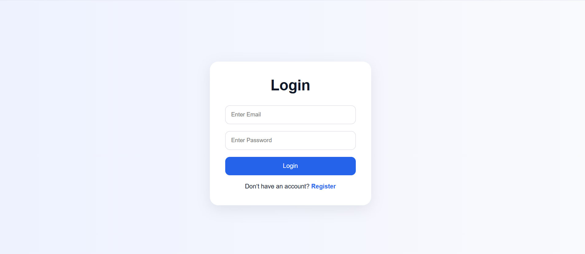
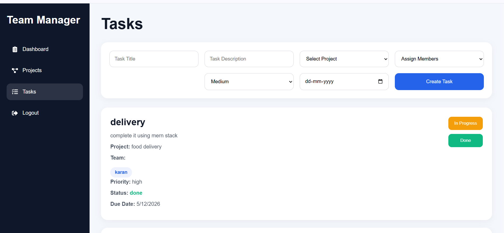
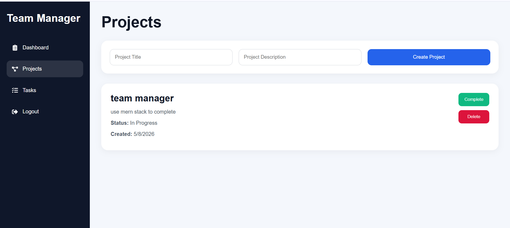
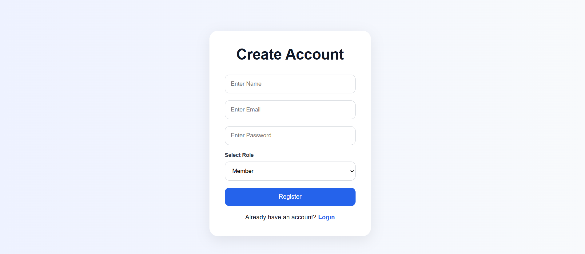

# Team Task Manager

A full-stack MERN application to manage projects and tasks within a team.
Admins can create projects, assign tasks to multiple members, track progress, and monitor overdue tasks. Members can view assigned tasks and update task status.

---

# Live Demo

[https://mohit-team-task-manage.up.railway.app](https://mohit-team-task-manage.up.railway.app)

---

# Tech Stack

## Frontend

* React.js
* React Router DOM
* Axios
* CSS

## Backend

* Node.js
* Express.js
* MongoDB
* JWT Authentication

## Deployment

* Railway

---

# Features

## Authentication

* User Registration
* User Login
* JWT Authentication
* Role-Based Access (Admin / Member)

## Admin Features

* Create Projects
* Update Projects
* Delete Projects
* Create Tasks
* Assign Tasks to Multiple Members
* Track Task Status
* View Pending Tasks
* View Completed Tasks
* View Overdue Tasks

## Member Features

* View Assigned Tasks
* Update Task Status
* Mark Task as Done

## Other Features

* Responsive Design
* Mobile Compatible
* Professional Dashboard UI
* Protected Routes

---

# Folder Structure

```bash
team-task-manager/
│
├── backend/
│   ├── src/
│   │   ├── controllers/
│   │   ├── middleware/
│   │   ├── models/
│   │   ├── routes/
│   │   └── server.js
│
├── frontend/
│   ├── src/
│   │   ├── components/
│   │   ├── pages/
│   │   ├── services/
│   │   └── App.jsx
```

---

# Installation

## Clone Repository

```bash
git clone <your-github-repo-link>
```

---

# Backend Setup

```bash
cd backend
npm install
npm start
```

Create `.env` file:

```env
MONGO_URI=your_mongodb_url
JWT_SECRET=your_secret_key
PORT=5000
```

---

# Frontend Setup

```bash
cd frontend
npm install
npm run dev
```

---

# Railway Deployment

## Backend

* Deploy backend on Railway
* Add environment variables

## Frontend

* Deploy frontend on Railway
* Connect frontend with backend API

---

# Screenshots

## Login Page



---

## Dashboard


---

## Tasks Page



---

## Projects Page



---
## Register Page

---


# Future Improvements

* Email Notifications
* File Uploads
* Team Chat System
* Dark Mode
* Calendar Integration

---

# Author

Mohit Thakur

---

# License

This project is developed for learning and portfolio purposes.
